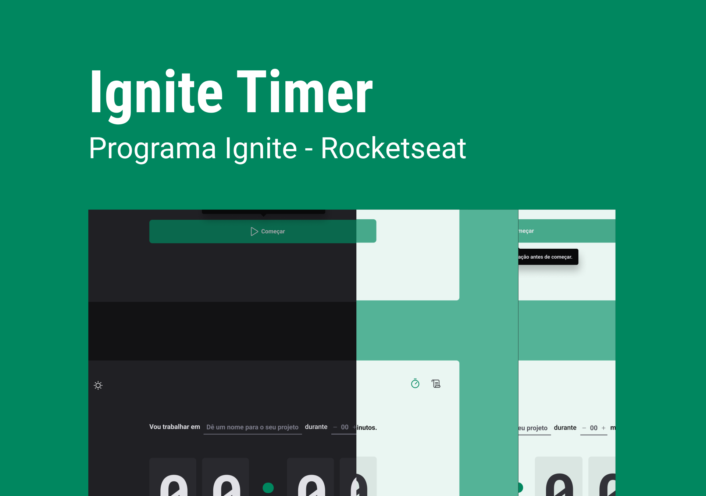

<h1 align="center">
  
</h1>

  

 

 

## ✨ Tecnologias

Esse projeto foi desenvolvido com as seguintes tecnologias:

- [React](https://react.dev/)
- [Typescript](https://www.typescriptlang.org/)
- [Vite](https://vitejs.dev/)

## 💻 Projeto

O Ignite Timer utiliza o conceito de técnicas de produtividade baseadas no método Pomodoro, onde os usuários podem criar ciclos para focar em seus projetos de forma mais eficiente.

## 🔖 Layout

Você pode visualizar o layout do projeto através [desse link](https://www.figma.com/file/Z04pVcNO2YyBENBdrzOqBX/Ignite-Timer?node-id=11-599&t=MFsKoo6hWqpICR7k-0). É necessário ter conta no [Figma](http://figma.com/) para acessá-lo.

## 🚀 Como executar

- Clone o repositório
- Instale as dependências com `yarn`
- Inicie seu app com `yarn dev`

## 📄 Licença

Desenvolvido durante o Treinamento Ignite da Rocketseat **por** [**rafaeld3v**](https://www.linkedin.com/in/rafaeld3v/) 🤖
